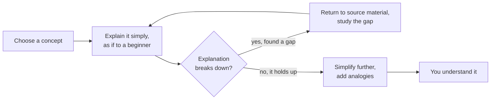

Ever since I started to take my education seriously, the first question that came to my mind is "how do I study effectively?"

The story began with traditional methods: note taking by outlining, mind maps, Cornell. However there's a very major problem with these traditional methods. Firstly, it's too easy to rewrite things without focusing on understanding. Take for example learning from a textbook. A lot of the time I found myself just rewriting keywords and concepts from a book without grasping the idea itself. Then I would add those keywords to Anki and call it done. This does not work well; you may pass an exam, but it's not true understanding. So let's take a step back here and answer the fundamental question: What it means to learn something.

## What it means to Learn

Learning has been around for as long as we have been around. We used to learn everything from our fathers, and later on universities were created with the aim of educating people. Methods of education have been studied for centuries and many great people suggested what it means to learn, and more importantly what it means to be a good teacher. Whenever you do any sort of self-study, you are your own teacher. The art of self-study is the art of teaching.

Plato in Plato's Apology & Meno argued that teaching needs to focus on recollection rather than lecturing. You need to make students reach the answer themselves. We see now that concepts learned by your own reasoning stick longer than lectures. Aristotle extended that in his book "Nicomachean Ethics" where he states that

> "For the things we have to learn before we can do them, we learn by doing them."

We need to not only arrive at concepts on our own, but also we need practical and pragmatic application. This is why pen and paper is so good for learning, you are forced to deal with the practicality rather than the digital. Learning is something done through action, not passively.

## Introducing Mathematics

While both Plato's and Aristotle's ideas are widely accepted and understood, it is incredibly hard to apply them on their own, in mathematics and physics. We don't have to look far however to get good advice for STEM fields. Carl Sagan states in "The Demon-Haunted World" that learning is "A balance between two seemingly contradictory attitudes, an openness to new ideas, and the most ruthlessly skeptical scrutiny of all ideas." We need to keep an open mind. Gilbert Strang, an MIT mathematician, furthermore agrees with Plato: "The key point is to think with them." Learning is not something that is delivered; it is done together, on the same level.

## The Feynman Method

Feynman is considered one of the best physicists. He isn't considered "the best," but he had something that many physicians and mathematicians lacked: Charisma and understanding. He knew how to talk with people. He was a good teacher and communicator. He proposed the Feynman method of learning:

The technique itself is deceptively simple, and it rests on one premise: if you cannot explain a concept in plain language, you don't actually understand it yet. Feynman never wrote it down as a formal numbered system himself — it's been reconstructed from his study habits and teaching style — but it's generally broken into four repeatable steps:

1. **Choose a concept.** Pick the exact idea you want to understand, and study it from your usual sources — a textbook, a lecture, a paper.
2. **Explain it in plain language.** Write or say the explanation as if you were teaching it to someone with no background — a curious 12-year-old is the classic target. No jargon allowed; if a technical term shows up, you have to unpack it too.
3. **Find the gaps.** The places where your explanation gets vague, circular, or you reach for a term you can't define are exactly the places you don't yet understand. Go back to the source material and fill them in.
4. **Simplify and use analogies.** Once the gaps are filled, tighten the explanation. Swap in analogies to things you already understand well, and cut anything that isn't doing work.

You loop through steps 2–4 until the explanation is clean enough that a stranger could follow it start to finish. That loop is the whole engine of the method:

What makes this powerful for maths and physics specifically is that it converts a vague feeling of "I get it" into a falsifiable test — either you can walk through the derivation in your own words, or the explanation stalls and shows you precisely where to go back and dig.

This isn't just folk wisdom either. A qualitative literature review by Harahap (2020) proposed the Feynman Technique as an alternative for online learning, arguing that having students teach a topic to themselves or to peers helps them notice gaps that passive video-watching hides. Closer to the subject of this post, an exploratory study of the Feynman method inside an actual physics classroom (Wea, Dua & Elizabeth, 2023) looked directly at whether the "explain it simply" loop holds up as a teaching tool for physics concepts, rather than just a productivity trick — which is exactly the kind of evidence I wanted before building a study system around it.

## The Socratic method

The Socratic method centers around the idea that students learn best by grasping the concepts themselves, rather than them being lectured by someone. Socratic argument will look like so:

> **Student:** I don't get why you can't divide by zero. Like, 6 ÷ 2 = 3 because 2 × 3 = 6. So 6 ÷ 0 should just be... whatever makes 0 × something = 6, right?
> 
> **Tutor:** Good instinct — division as "the number that multiplies back to give you the original." So what number, multiplied by 0, gives you 6?
> 
> **Student:** Um. Nothing does, because anything times 0 is 0.
> 
> **Tutor:** Right. So using your own rule, what does that tell you about 6 ÷ 0?
> 
> **Student:** ...that there's no answer? Because no number satisfies it.
> 
> **Tutor:** Exactly. Now try 0 ÷ 0 with the same rule — what number, times 0, gives 0?
> 
> **Student:** Oh — that's _every_ number. 5 × 0 = 0, 100 × 0 = 0, all of them work.
> 
> **Tutor:** So what's different about this case compared to 6 ÷ 0?
> 
> **Student:** 6 ÷ 0 has no answer because nothing works, but 0 ÷ 0 has no _single_ answer because everything works. So division by zero isn't "forbidden" for no reason — it's just that the question stops having one clean answer either way.
> 
> **Tutor:** That's the idea. Division by zero isn't a rule someone made up to be annoying — it's undefined because your own definition of division breaks down in both directions.

Notice what the tutor never does: at no point does the tutor state the fact "division by zero is undefined." Every single line is a question that hands the student's own earlier reasoning back to them. The tutor's only job is to:

- **Anchor the definition.** The tutor gets the student to restate what division _means_ ("the number that multiplies back to the original"), because most confusion about division by zero comes from treating it as a memorized rule instead of a consequence of a definition.
- **Apply the student's own rule to a new case.** Rather than correcting the student, the tutor simply asks the student to run their own logic on 6 ÷ 0, so the contradiction is something the student discovers, not something they're told.
- **Escalate to a harder case.** Once the student sees why 6 ÷ 0 fails, the tutor immediately pushes to 0 ÷ 0 — a case that fails for a _different_ reason (too many answers instead of none). This forces the student to generalize the idea rather than memorize one example.
- **Let the student state the conclusion.** The final synthesis — "no single answer either way" — comes out of the student's mouth, not the tutor's. That's the whole point: the student now owns a piece of reasoning they built themselves, rather than a fact they were handed.

The benefits of this are immense. The student cements a specific pathway to knowledge in his mind, rather than loosely connected concepts. You no longer memorise; you critically analyse _why_ this concept works like this.

## How AI can help

This method of learning works great with AI. I have drafted a skill for specifically this, and you can find it at the end of this post. This skill will never tell you the answer to a question, it will _make_ you come to the conclusion by yourself, which is what makes it so powerful.

This method of study is backed by new research, which uses specifically the methods of Feynman and Socrates to do learning.

## Further Reading

If you want to learn more about this topic, have a look at the papers below:

- [[Findings of MEGA - Maths Explanation with LLMs using the socratic Method for Active Learning]] — [arXiv:2507.12079](https://arxiv.org/abs/2507.12079)
- [[Socratic method as a therapeutic discourse for mental health]] — [Diagnostics and Therapeutics, vol. 4, no. 1 (2025)](https://ojs.luminescience.cn/DT/article/view/323)
- [[An Alternative Method of Online Learning Using The Feynman Technique]] — [Harahap (2020), ResearchGate](https://www.researchgate.net/publication/348872629_An_Alternative_Method_Of_Online_Learning_Using_The_Feynman_Technique)
- [[An Exploratory Study to Investigate the Implementation of Feynman Learning Method in a Physics Classroom]] — [Wea, Dua & Elizabeth (2023), Universitas Negeri Semarang](https://oalib-perpustakaan.upi.edu/Record/doaj_ea1fc9e97c7f45ecbc05193c2f5f6a42)
